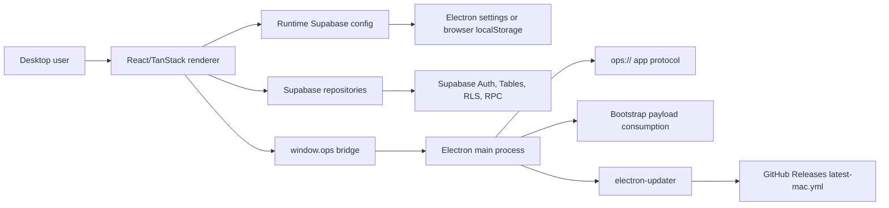

# Architecture

Ops is a medium-sized single-package desktop app. The renderer owns the product interface and calls Supabase directly. The Electron side provides native window setup, a secure app protocol, local desktop settings, updater support, and a small set of bridge methods exposed through `window.ops`.

## System Overview

## Renderer

The renderer lives under `src/` and uses TanStack Router file routes:

- `src/routes/onboarding.tsx` configures the runtime Supabase connection and creates the first administrator.
- `src/routes/login.tsx` signs users in with Supabase Auth.
- `src/routes/analytics.tsx` renders the RPC-backed analytics dashboard.
- `src/routes/tables.$table.tsx` renders the schema-driven CRUD console.
- `src/routes/settings.tsx` manages runtime connection, local settings, identity context, and app updates.
- `src/routes/__root.tsx` owns the shell layout, auth/config guards, updater notification, and navigation chrome.

The HTML root is `index.html`. It sets `lang="en"`, the Google `notranslate` meta tag, and `translate="no"` so browser translation tools do not mutate the app DOM.

## Schema-Driven Console

`src/lib/schema-registry.ts` is the main UI contract for the data console. It defines:

- 31 Supabase table configs.
- Table groups: identity, catalog, CRM, inventory, and commerce.
- List columns, field definitions, field groups, relation lookups, enum options, defaults, and editable fields.
- Soft-delete behavior through `deleted_at` and `lifecycle_status`.
- Join editor types for related records.
- Transactional action markers for orders and inventory.

`src/lib/schema-tables.ts` turns that registry into sidebar groups and hides join tables that are edited through parent records. `src/lib/hidden-join-routes.ts` redirects direct join-table routes to their parent console views.

## Data Access Layer

Supabase access is centralized in `src/lib/db/repositories/`:

- `table-crud-repository.ts` handles generic list, create, update, archive, hard delete, and lookup operations.
- `console-read-repository.ts` uses read-model RPCs for selected tables and falls back to direct table reads when those RPCs are not available.
- `console-joins-repository.ts` syncs related records through RPCs instead of editing join rows manually.
- `orders-repository.ts` wraps order-specific RPCs such as `update_order_status` and `finalize_sale`.
- `inventory-levels-repository.ts` wraps `reserve_inventory_stock` and `release_inventory_stock`.
- `analytics/*` repositories call analytics RPCs and compose dashboard data.

The frontend uses Supabase `from`, `rpc`, and `auth` calls. There is no local business database layer in this repository.

## Supabase Boundary

Supabase owns:

- Authentication and session persistence.
- Table storage.
- Row-level security and JWT-based authorization assumptions.
- RPC functions for transactional flows, analytics, read models, joins, and first-admin bootstrap.

The codebase includes a generated TypeScript contract in `src/types/database.ts`, but it does not include SQL migrations or seed scripts. Any schema change must keep the Supabase project, `src/types/database.ts`, and `src/lib/schema-registry.ts` aligned.

## Runtime Configuration Flow

The app resolves Supabase configuration through `src/lib/supabase/runtime-config.ts`:

1. In Electron, call `window.ops.config.consumeSupabaseBootstrapPayload()` to import and delete a one-time `bootstrap/supabase.json` payload.
2. Read saved runtime config from the Electron settings bridge under `supabase.runtime.connection`.
3. In web-only or development mode, use `.env.local` values as fallback.

When the connection changes, the app resets the cached Supabase client with `resetSupabaseClient()` and emits an in-window config change event.

## Electron Shell

The Electron shell lives under `electron/`:

- `electron/main/index.ts` registers the `ops://` protocol, creates the main window, denies native permissions by default, blocks unexpected navigation/window opens, handles local settings, consumes bootstrap payloads, provides native Supabase Auth fallback, and wires auto-update events.
- `electron/preload/index.ts` exposes only the typed `window.ops` bridge through `contextBridge`.
- `electron/shared/ops-api.ts` and `electron/shared/ipc.ts` define the public bridge and IPC channel names.

The shell does not implement business CRUD and does not include SQLite, `sqlx`, or a local SQL plugin.

## Update Flow

In production mode, `src/routes/__root.tsx` checks for updates after authentication. `src/lib/updater.ts` wraps the Electron bridge and returns serializable update states. The Settings page lets the user check, download, install, and restart when an update is available.

`electron-builder.yml` configures GitHub publishing. `.github/workflows/release-macos.yml` builds Electron output, packages macOS assets, and publishes update metadata for `electron-updater`.

## Architectural Constraints

- Business data access belongs in Supabase repositories, not in Electron main.
- Critical state transitions should use Supabase RPCs.
- Client code must assume JWT and RLS enforcement.
- Local settings may use the Electron settings bridge, but business state must not be persisted locally.
- Renderer code must not import `electron`, `ipcRenderer`, Node APIs, or main-process modules.
- Any new table surface should start from `src/types/database.ts` and `src/lib/schema-registry.ts`.
